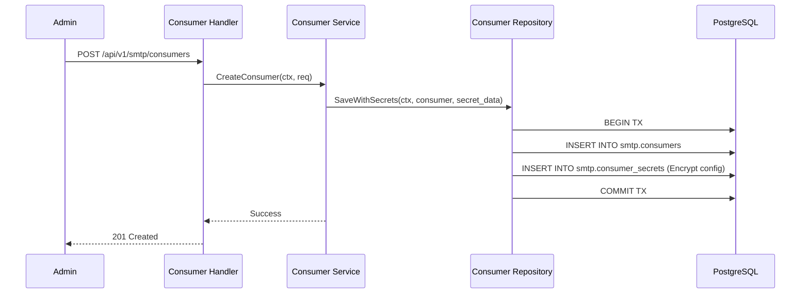
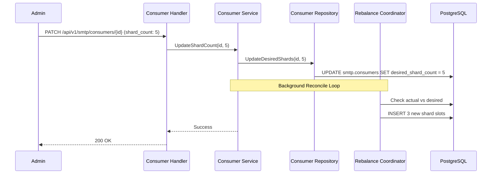

# Consumer Flows Documentation

Nhóm này mô tả cách hệ thống cấu hình và quản lý các Consumer - các "đầu nạp" dữ liệu từ Kafka, RabbitMQ hoặc các hàng chờ khác.

---

## Flow 1: Consumer Configuration & Secret Management
**Mô tả**: Thiết lập thông tin kết nối và lưu trữ thông tin nhạy cảm (Password/Key) an toàn.

### Use Case
Admin cấu hình một Kafka Consumer để đọc tin nhắn từ topic `email_notifications`.

### Sequence Diagram

### Tech Lead Spec
*   **Secret Separation**: Thông tin nhạy cảm (`consumer_secrets`) được tách riêng bảng với cấu hình chung để áp dụng các lớp bảo mật và mã hóa khác nhau.
*   **Transport Types**: Hỗ trợ đa dạng giao thức (`kafka`, `pubsub`, `webhook`) định nghĩa qua Enum `smtp.consumer_transport_type`.

---

## Flow 2: Consumer Runtime Scaling (Sharding)
**Mô tả**: Điều chỉnh số lượng worker thực tế xử lý hàng chờ của Consumer.

### Use Case
Hàng chờ email bị nghẽn, Admin tăng `desired_shard_count` từ 2 lên 5 để tăng tốc độ xử lý.

### Sequence Diagram

### Tech Lead Spec
*   **Horizontal Scaling**: Mỗi Shard tương ứng với một đơn vị xử lý song song. Việc tăng shard count sẽ kích hoạt Coordinator phân bổ thêm node Data Plane vào luồng xử lý này.
*   **Lag Monitoring**: Số lượng shard nên được điều chỉnh dựa trên chỉ số `lag` được báo cáo từ Data Plane.
