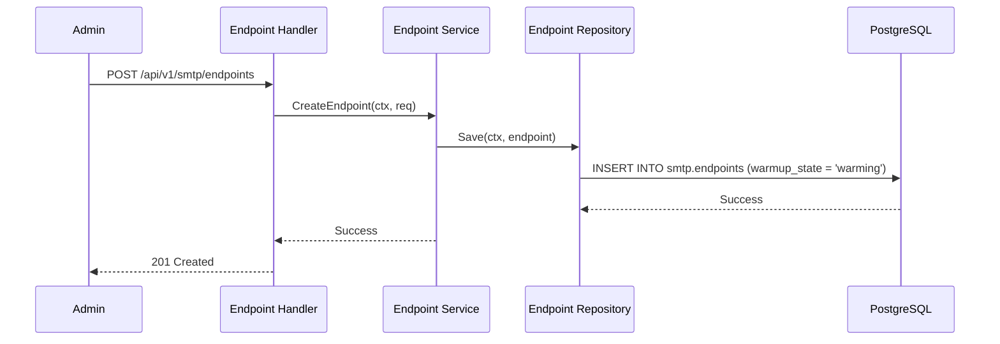
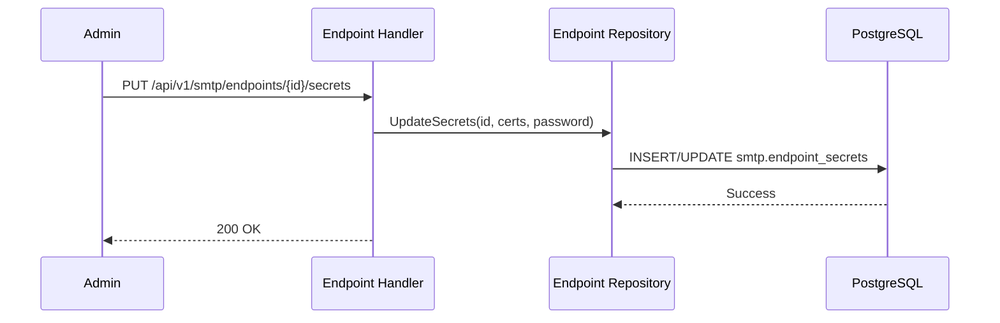

# Endpoint Flows Documentation

Nhóm này mô tả cách quản lý các Endpoint - hạ tầng vật lý (SMTP Server, SES, SendGrid) thực hiện việc gửi tin cuối cùng.

---

## Flow 1: Endpoint Provisioning & Warmup
**Mô tả**: Thêm mới một server SMTP và thiết lập chế độ Warmup (làm nóng IP).

### Use Case
Hệ thống thêm một IP mới từ AWS SES và cần gửi lượng tin tăng dần để tránh bị đánh dấu là Spam (Warmup state).

### Sequence Diagram

### Tech Lead Spec
*   **Warmup States**: `stable`, `warming`, `failed`. Trạng thái `warming` thường đi kèm với giới hạn `max_messages_per_second` thấp.
*   **TLS Mode**: Hỗ trợ các chế độ bảo mật `none`, `ssl/tls`, `starttls` cấu hình trực tiếp trên Endpoint.

---

## Flow 2: Endpoint Secret Management
**Mô tả**: Lưu trữ chứng chỉ (Certificates) và mật khẩu truy cập server SMTP.

### Use Case
Người dùng tải lên file `.pem` (CA Cert) để thiết lập kết nối an toàn với mail server nội bộ.

### Sequence Diagram

### Tech Lead Spec
*   **Encryption at Rest**: Mọi thông tin trong `smtp.endpoint_secrets` phải được mã hóa trước khi lưu vào DB.
*   **Dynamic Reload**: Khi secret thay đổi, node thực thi cần ngắt các kết nối cũ (Connection Pool) và khởi tạo lại với chứng chỉ mới.
