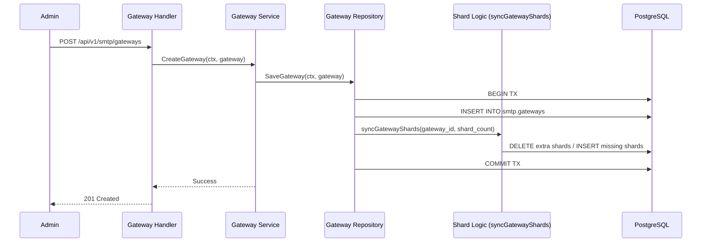
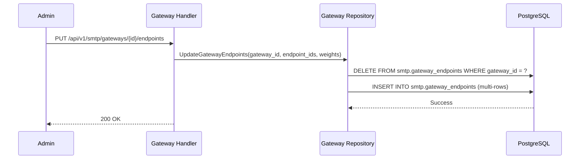
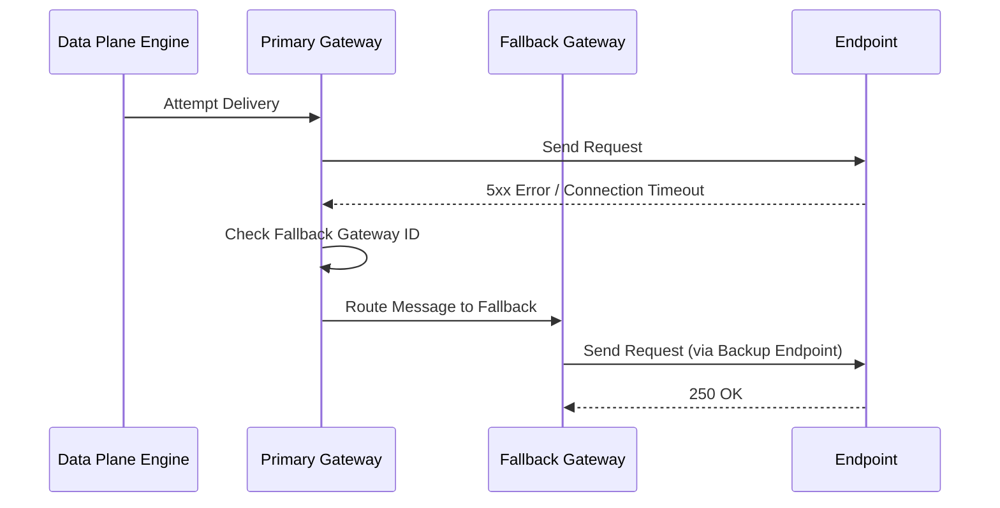

# Gateway Flows Documentation

Nhóm này mô tả các luồng xử lý liên quan đến Gateway - thành phần điều phối và định tuyến tin nhắn chính trong hệ thống SMTP.

---

## Flow 1: Gateway Provisioning (Create/Update)
**Mô tả**: Người dùng tạo mới hoặc cập nhật cấu hình Gateway (Traffic Class, Priority, Shard Count).

### Use Case
Admin cấu hình một Gateway mới để phục vụ luồng gửi tin "Transactional" với mức ưu tiên cao nhất.

### Sequence Diagram

### Tech Lead Spec
*   **Shard Pre-allocation**: Khác với các tài nguyên khác, khi tạo Gateway, hệ thống phải khởi tạo ngay các slot trong bảng `smtp.gateway_shards` để bộ điều phối (Coordinator) có thể bắt đầu gán node.
*   **Runtime Version**: Cập nhật Gateway sẽ làm tăng version toàn cục, buộc các Data Plane phải load lại routing table.

---

## Flow 2: Gateway Endpoint Mapping & Priority
**Mô tả**: Gán các Endpoint (hạ tầng gửi tin) vào Gateway và thiết lập mức độ ưu tiên.

### Use Case
Người dùng gán 2 Endpoint SMTP vào 1 Gateway: 1 cái là Main (Priority 1), 1 cái là Backup (Priority 2).

### Sequence Diagram

### Tech Lead Spec
*   **Routing Metadata**: Dữ liệu này được lưu trong bảng trung gian `smtp.gateway_endpoints`.
*   **Cache Invalidation**: Việc thay đổi mapping này không làm thay đổi `runtime_version` của bản thân Gateway (trừ khi có trigger hỗ trợ), nên cần lưu ý cơ chế cập nhật tại node thực thi.

---

## Flow 3: Gateway Fallback Logic
**Mô tả**: Cách hệ thống tự động chuyển vùng khi Gateway chính gặp sự cố.

### Use Case
Gateway "High-Speed" bị lỗi hoặc quá tải, hệ thống tự động định tuyến tin nhắn sang Gateway "Slow-Backup".

### Sequence Diagram

### Tech Lead Spec
*   **Recursive Check**: Logic fallback có thể hỗ trợ nhiều cấp (G1 -> G2 -> G3).
*   **Metric Impact**: Khi xảy ra fallback, `activity_logs` cần ghi nhận để Admin có thể phát hiện hạ tầng chính đang gặp vấn đề.
