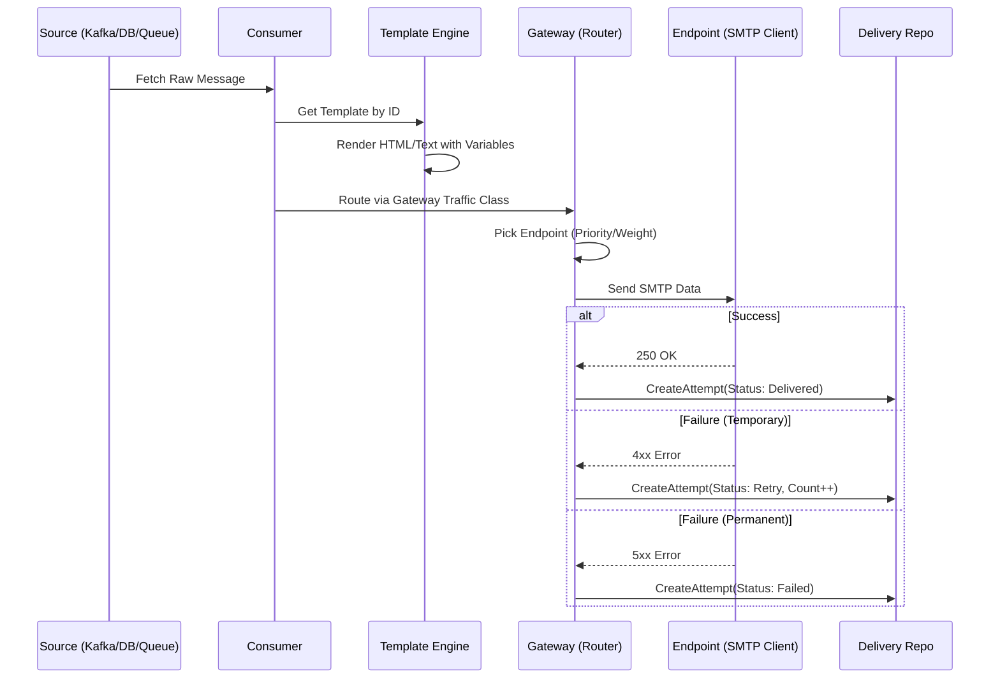

# Message Delivery Flow

## 1. Tổng quan (Use Case)
Hệ thống nhận yêu cầu gửi tin từ một nguồn dữ liệu (Source), áp dụng mẫu (Template), chọn luồng ưu tiên (Gateway) và thực hiện gửi qua hạ tầng SMTP (Endpoint).

## 2. Đặc tả kỹ thuật (Tech Lead Spec)
*   **Composition**: 1 Consumer -> 1 Template -> 1 Gateway -> N Endpoints.
*   **Routing Logic**:
    *   Gateway đóng vai trò là một logical load balancer.
    *   Endpoint được chọn dựa trên **Priority** (thấp hơn ưu tiên hơn) và **Weight** (trọng số trong cùng priority).
*   **Observability**: Mọi nỗ lực gửi tin (Attempt) đều phải được ghi log kèm theo `trace_id` để tracing liên kết giữa Control Plane và Data Plane.

## 3. Sequence Diagram

## 4. Cơ chế Retry
*   **Retry Backoff**: Thời gian chờ giữa các lần retry được cấu hình tại Template (`retry_backoff_seconds`).
*   **Max Attempts**: Giới hạn số lần thử lại để tránh nghẽn hàng chờ.
