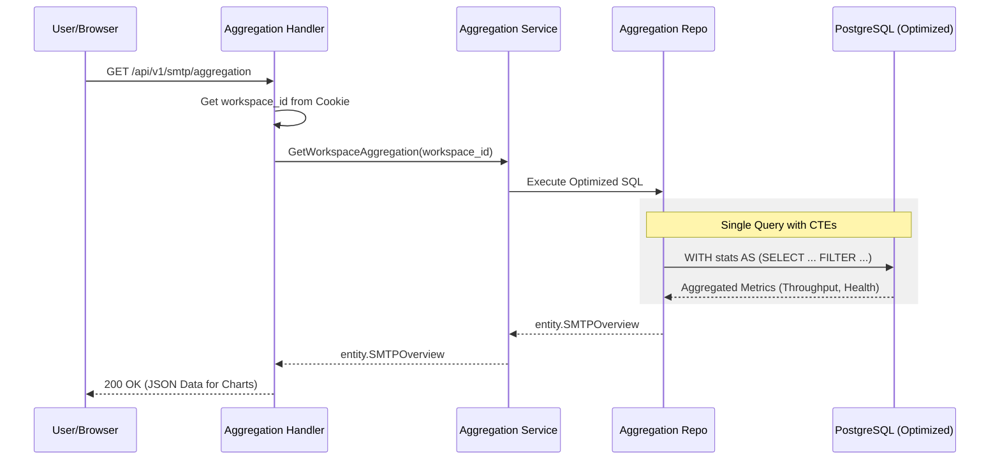

# Observability & Aggregation Flow

## 1. Tổng quan (Use Case)
Người dùng truy cập Dashboard để theo dõi hiệu năng hệ thống theo thời gian thực (Real-time). Hệ thống phải tổng hợp hàng triệu bản ghi log để đưa ra các con số thống kê chính xác (Delivered, Queued, Failed).

## 2. Đặc tả kỹ thuật (Tech Lead Spec)
*   **Query Optimization**: Sử dụng **CTE (Common Table Expressions)** để giảm số lượng sub-queries.
*   **Filtering**: Tận dụng `COUNT(1) FILTER (WHERE ...)` để tính toán nhiều chỉ số chỉ trong một lần quét bảng (Single Table Scan).
*   **Indexing Strategy**: Dựa trên Composite Index `(workspace_id, created_at DESC)` để lọc dữ liệu cực nhanh theo từng khách hàng.
*   **Concurrency**: Sử dụng `FULL OUTER JOIN` giữa các bảng cấu hình để đảm bảo các tài nguyên không có hoạt động vẫn hiển thị trên Dashboard với giá trị 0.

## 3. Sequence Diagram

## 4. Các thành phần dữ liệu chính
1.  **Core Metrics**: Tổng số tin đã gửi hôm nay, số tin đang chờ.
2.  **Health Distribution**: Biểu đồ tròn trạng thái Gateway (Healthy/Warning/Stopped).
3.  **Delivery Throughput**: Dữ liệu biểu đồ đường (Line chart) 7 ngày gần nhất.
4.  **Timeline**: 10 sự kiện thay đổi cấu hình hoặc lỗi nghiêm trọng mới nhất.
