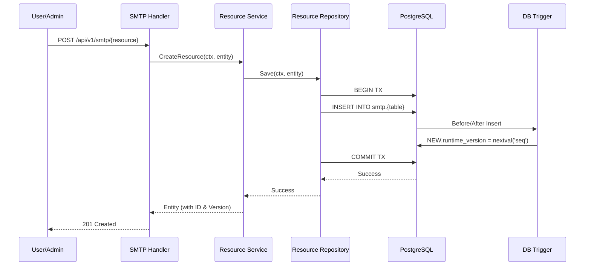

# Resource Management Flow

## 1. Tổng quan (Use Case)
Người dùng (Admin/Workspace Owner) thực hiện tạo, cập nhật hoặc xóa các tài nguyên SMTP (Gateway, Template, Consumer, Endpoint) thông qua giao diện quản trị hoặc API. Mục tiêu là thiết lập cấu hình gửi tin cho Workspace.

## 2. Đặc tả kỹ thuật (Tech Lead Spec)
*   **Kiến trúc**: RESTful API -> Service Layer -> Repository Layer -> PostgreSQL.
*   **Cơ chế Versioning**: Sử dụng `runtime_version` dựa trên PostgreSQL Sequence. Mọi thao tác ghi (Write) đều kích hoạt trigger để tăng version, giúp hệ thống nhận biết sự thay đổi cấu hình một cách hiệu quả (Delta check).
*   **Tính toàn vẹn**: Sử dụng Database Transactions (ACID) để đảm bảo dữ liệu cấu hình và bí mật (Secrets) được lưu trữ đồng thời.

## 3. Sequence Diagram

## 4. Chi tiết các bước
1.  **Validation**: Service kiểm tra tính hợp lệ của dữ liệu (ví dụ: định dạng email, tính duy nhất của tên trong Workspace).
2.  **Trigger Logic**: `trg_smtp_{resource}_runtime_version` tự động chạy mỗi khi có Update/Insert để thông báo cho toàn hệ thống rằng cấu hình đã thay đổi.
3.  **Side Effects**: Một số tài nguyên (như Consumer/Gateway) khi được tạo sẽ kích hoạt hàm `syncShards` để chuẩn bị các slot xử lý dữ liệu.
