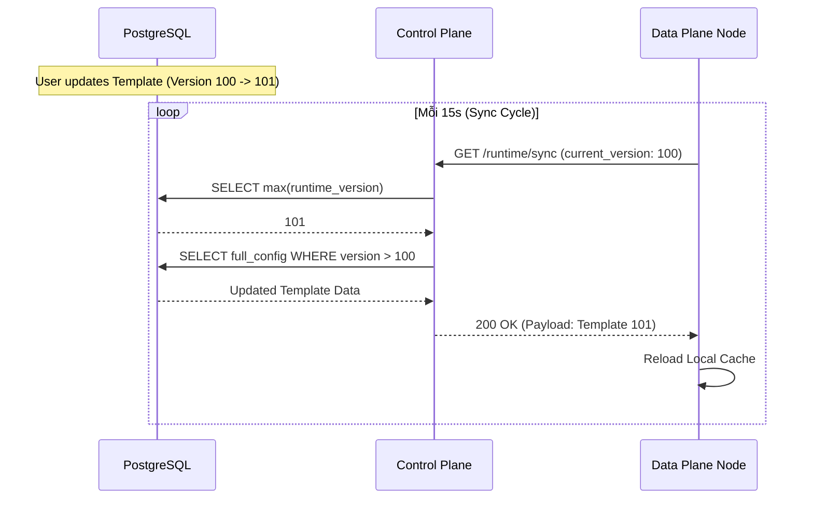
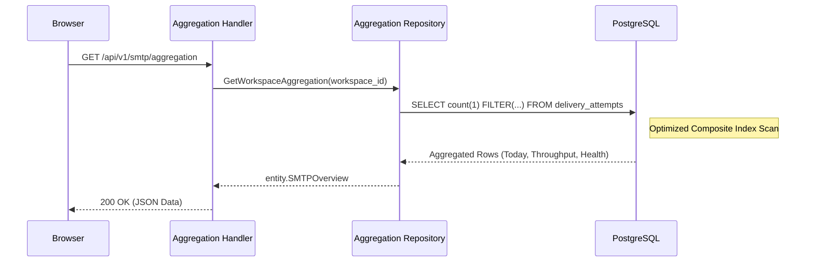

# Runtime & Operational Flows Documentation

Nhóm này mô tả các luồng vận hành hệ thống, bao gồm đồng bộ trạng thái node và tổng hợp dữ liệu Dashboard.

---

## Flow 1: Node Synchronization (Config Convergence)
**Mô tả**: Đảm bảo tất cả các node Data Plane đều chạy với cấu hình mới nhất từ Control Plane.

### Use Case
Admin vừa cập nhật Template, Data Plane cần nhận diện thay đổi này để render email chính xác.

### Sequence Diagram

### Tech Lead Spec
*   **Eventual Consistency**: Hệ thống đạt trạng thái đồng nhất sau tối đa một chu kỳ Sync.
*   **Payload Optimization**: Sử dụng Gzip compression cho Sync Payload khi số lượng tài nguyên lớn.

---

## Flow 2: Dashboard Data Aggregation
**Mô tả**: Tổng hợp log gửi tin để hiển thị biểu đồ và chỉ số hiệu năng.

### Use Case
Người dùng mở Dashboard xem tỷ lệ gửi thành công trong 24h qua.

### Sequence Diagram

### Tech Lead Spec
*   **Query Performance**: Truy vấn sử dụng các hàm `FILTER` và `date_trunc` để tránh phải tính toán ở tầng Application.
*   **Index Usage**: Bắt buộc sử dụng Index `(workspace_id, created_at DESC)` để duy trì tốc độ < 100ms.
