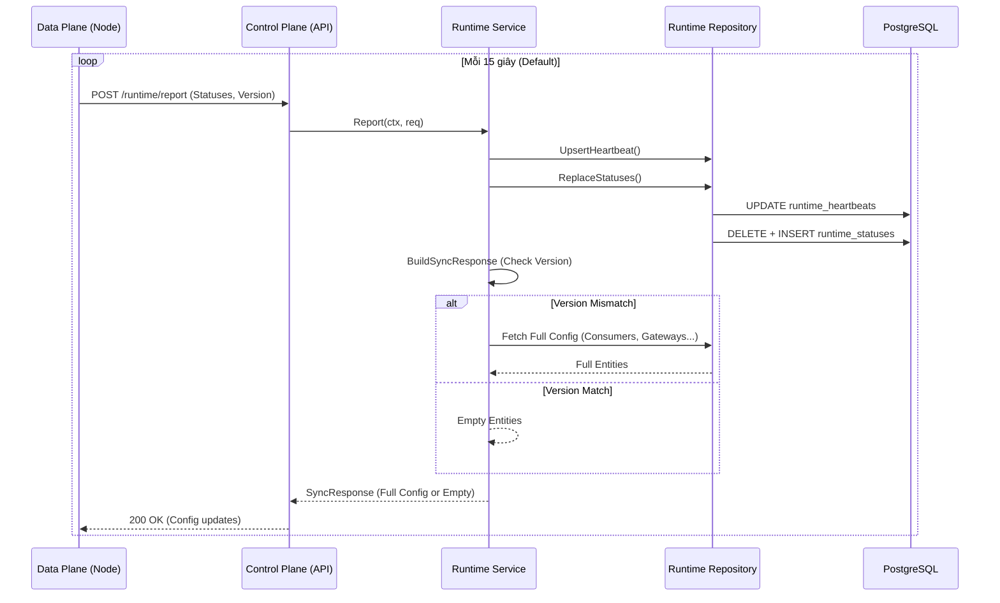

# Runtime Sync & Report Flow

## 1. Tổng quan (Use Case)
Data Plane (node thực thi) định kỳ kết nối với Control Plane để:
1.  Lấy cấu hình mới nhất nếu có sự thay đổi version.
2.  Báo cáo tình trạng sức khỏe, hiệu năng và các lỗi runtime đang gặp phải.

## 2. Đặc tả kỹ thuật (Tech Lead Spec)
*   **Pull Mechanism**: Data Plane chủ động gọi (Pull) thay vì Control Plane đẩy (Push) để tránh các vấn đề về Firewall/NAT.
*   **Version Comparison**: Control Plane so sánh `local_version` từ Data Plane gửi lên với `global_version` trong DB. Chỉ gửi payload cấu hình nặng nếu `global_version > local_version`.
*   **Status Replacement**: Sử dụng cơ chế "Delete & Insert" (Replace) trong một transaction cho các bảng `runtime_status` để đảm bảo dữ liệu báo cáo luôn mới nhất mà không bị rác.

## 3. Sequence Diagram

## 4. Đặc điểm nổi bật
*   **Heartbeat**: Nếu quá 3 chu kỳ (45s) không có report, Control Plane coi node đó đã chết và kích hoạt Rebalance.
*   **Atomic Updates**: Việc thay thế trạng thái Status diễn ra trong Transaction để Dashboard không bao giờ hiển thị trạng thái rỗng.
