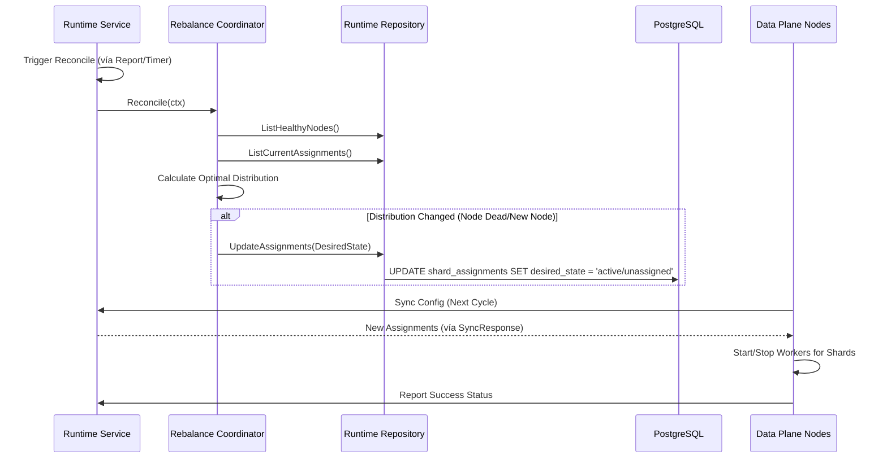

# Sharding & Rebalance Flow

## 1. Tổng quan (Use Case)
Khi có một node Data Plane mới gia nhập hoặc một node cũ bị chết, hệ thống cần tự động tính toán lại việc phân bổ các Shard (phiên xử lý) để đảm bảo tải được chia đều và không có email nào bị bỏ sót.

## 2. Đặc tả kỹ thuật (Tech Lead Spec)
*   **Coordinator Pattern**: Sử dụng logic `rebalance.Coordinator` để tính toán trạng thái đích (Desired State) so với trạng thái hiện tại (Actual State).
*   **Lease Mechanism**: Mỗi shard assignment có một `lease_expires_at`. Nếu node giữ shard không gia hạn heartbeat, lease sẽ hết hạn và shard được giải phóng.
*   **State Machine**: Shard di chuyển qua các trạng thái: `pending` -> `active` -> `revoking` -> `unassigned`.
    *   `revoking`: Node cũ đang dọn dẹp các queue inflight trước khi nhả shard.

## 3. Sequence Diagram

## 4. Ràng buộc kỹ thuật
1.  **Anti-Entropy**: Quá trình Reconcile chạy liên tục để đảm bảo hệ thống luôn hội tụ về trạng thái mong muốn.
2.  **Graceful Revocation**: Trạng thái `revoking` đảm bảo tin nhắn đang gửi không bị gián đoạn đột ngột khi chuyển node.
