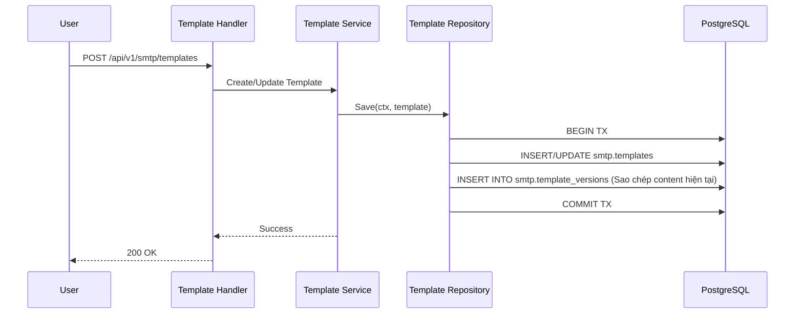
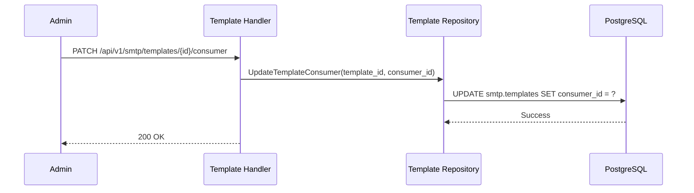

# Template Flows Documentation

Nhóm này mô tả các luồng xử lý liên quan đến Template - định nghĩa nội dung, biến số và cấu hình retry cho email.

---

## Flow 1: Template Authoring & Versioning
**Mô tả**: Người dùng tạo nội dung email và hệ thống tự động lưu trữ phiên bản cũ để có thể rollback.

### Use Case
Marketer cập nhật nội dung chương trình khuyến mãi trong Template nhưng muốn giữ lại phiên bản cũ để đối chiếu.

### Sequence Diagram

### Tech Lead Spec
*   **Immutable Versions**: Bảng `smtp.template_versions` lưu trữ snapshot của `subject`, `body_html`, `body_text` tại thời điểm thay đổi.
*   **Active Version**: Trường `active_version` trong bảng chính xác định phiên bản nào sẽ được node thực thi sử dụng để render tin nhắn.

---

## Flow 2: Template - Consumer Association
**Mô tả**: Gán một Template vào một Consumer để xác định nguồn dữ liệu sẽ "đổ" vào mẫu này.

### Use Case
Người dùng gán Template "Welcome Email" vào Consumer "User Registration Kafka" để tự động gửi email khi có người đăng ký mới.

### Sequence Diagram

### Tech Lead Spec
*   **Constraint Check**: Một Template tại một thời điểm chỉ nên thuộc về một Consumer (hoặc được dùng chung tùy cấu hình).
*   **Runtime Impact**: Khi gán Consumer, `runtime_version` của Template tăng lên, kích hoạt Data Plane cập nhật bộ nạp dữ liệu (data fetcher).
